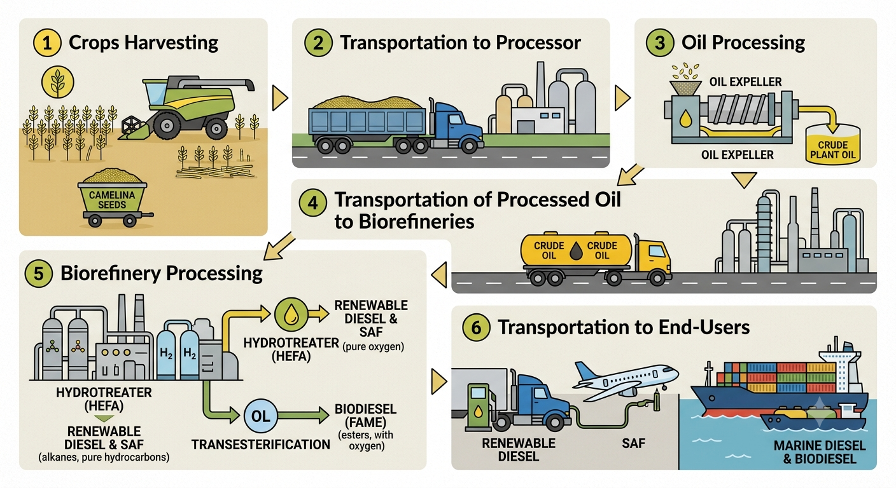

<b>Research and analysis of biomass-based fuels as potential cost-effective energy resources.</b>

# Plant-based source of energy: energy crops

-   Four main types of biomass-derived liquid and gas fuels:
    -   Ethanol;
    -   Alkanes / Paraffins (SAF, Renewable Diesel, Renewable Gasoline);  
    -   Renewable Natural Gas - RNG (Biomethane);  
    -   FAME - Fatty Acid Methyl Esters (Biodiesel);  

   
**This Website is focusing on the Alkanes / Paraffins and FAME types.  Both use the same feedstocks (particularly plant oils: e.g. Camelina, soybean, canola, palm, and sunflower oil.**

-  Biomass-based alkanes and FAME remain more expensive to produce than their petroleum counterparts. However, they offer drop-in alternatives that allow for greater energy source diversification.  
